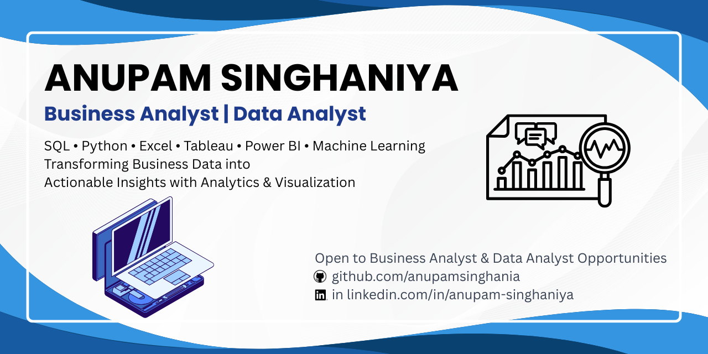

  

  

<h1 align="center">Hi 👋, I'm Anupam Singhaniya</h1>

<h3 align="center">
Business Analyst | Data Analyst | Business Intelligence Enthusiast
</h3>

Transforming Business Data into Actionable Insights through Analytics, Visualization & Data-Driven Decision Making.

---

## 👨‍💼 About Me

I am a Business Analytics postgraduate with a strong interest in solving business problems using data. I enjoy working with structured and unstructured datasets to uncover trends, build dashboards, automate reporting, and support strategic decision-making.

My focus is on developing practical analytical solutions using SQL, Python, Excel, Tableau, and Power BI while continuously improving my business intelligence and data storytelling skills.

---

## 💼 Areas of Interest

- Business Analytics
- Data Analytics
- Business Intelligence
- Dashboard Development
- KPI Reporting
- Data Visualization
- Process Improvement
- Decision Support Analytics

---

## 🛠️ Technical Skills

### Programming & Query Languages

- SQL
- Python

### Analytics & BI

- Microsoft Excel
- Tableau
- Power BI

### Database

- MySQL

### Data Analysis

- Data Cleaning
- Exploratory Data Analysis
- Regression Analysis
- Statistical Analysis
- KPI Analysis

### Version Control

- Git
- GitHub

---

## 🚀 Featured Projects

### 📊 Business Data Cleaning & Excel Reporting
Business data cleaning, validation, preprocessing and reporting using Excel and Python.

### 📈 KPI Framework & Business Experiment Analysis
Designed KPI dashboards and performed business experiment analysis to derive actionable recommendations.

### 📉 Regression Analysis for Business Insights
Performed regression modeling, residual analysis and business interpretation using Python.

### 📊 Interactive Tableau Dashboard
Developed an interactive dashboard for business reporting and performance tracking using Tableau.

### 🤖 AI Solution Design
Designed AI-powered business solutions by identifying opportunities, use cases and implementation strategies.

### 💡 Prompt Engineering Portfolio
Collection of practical prompt engineering use cases and AI productivity workflows.

---

## 📚 Currently Learning

- Advanced SQL
- Power BI
- Business Intelligence
- Data Storytelling
- Machine Learning for Analytics

---

## 🧰 Tools & Technologies

---

## 📈 GitHub Statistics

---

## 🤝 Connect with Me

📧 **Email**

anupamsinghania0157@gmail.com

💼 **LinkedIn**

https://www.linkedin.com/in/anupam-singhaniya/

💻 **GitHub**

https://github.com/anupamsinghania

---

⭐ Thank you for visiting my profile!

